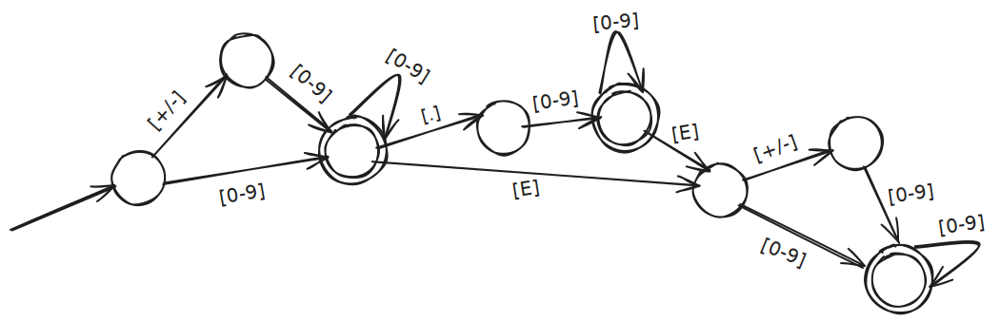
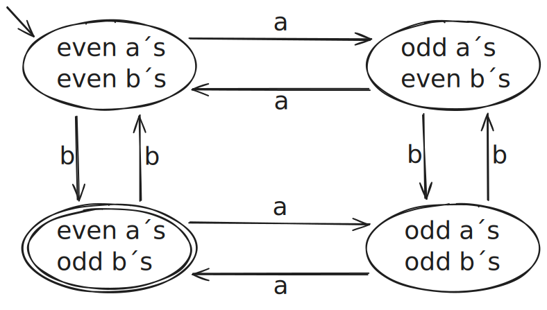
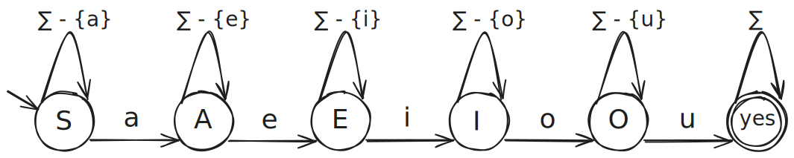

# CO3408 – Week 11 Lab: Finite State Machines & Automata Theory

## Learning Outcomes

By completing this lab, you will be able to:
* Design DFAs and NFAs for given languages
* Distinguish between deterministic and non-deterministic models
* Identify accepting states and transitions
* Reason about language acceptance using automata
* Convert informal language descriptions into formal FSMs

---

## Lab Task 1: Floating-Point Numbers (DFA)

Let FLOAT = { w : w is the string representation of a floating point number}.  Design a DFSM. Assume the following syntax for floating point numbers:

* A floating-point number is an optional sign, followed by a decimal number, followed by an optional exponent.
* A decimal number may be of the form x or x.y, where x and y are nonempty strings of decimal digits.
* An exponent begins with E and is followed by an optional sign and then an integer.
* An integer is a nonempty string of decimal digits.

So, for example, these strings represent floating point numbers:
+3.0, 3.0, 0.3E1, 0.3E+1, -0.3E+1, -3E8

## Lab Task 2: Even Number of a’s and Odd Number of b’s (DFA)

Let L={w∈{a,b}∗∣w has an even number of a’s and an odd number of b’s}. 

To design a DFA that accepts L, we only need to remember:
* whether the number of a’s seen so far is even or odd, and
* whether the number of b’s seen so far is even or odd.
Each character read updates only its own count.
Since there are:
* 2 possibilities for a’s (even / odd), and
* 2 possibilities for b’s (even / odd),
the DFA needs 4 states, each representing one combination.
The DFA accepts a string if it ends in the state:
* even number of a’s, and
* odd number of b’s.
Accepted: b, aab, aa, bbb
Rejected: ε, bb, ab, aaa, abba

## Lab Task 3: All the Vowels in Alphabetical Order (NFA)

Let L = {w  {a - z}* : all five vowels, a, e, i, o, and u, occur in w in alphabetical order}. So L contains words like abstemious, facetious, and sacrilegious. But it does not contain tenacious, which does contain all the vowels, but not in the correct order. It is hard to write a clear, elegant program to accept L. But designing a DFSM is simple. The following machine M does the job. In this description of M, let the label “ - {a}” mean “all elements of  except a” and let the label “” mean “all elements of ”. Note:  Σ − {a} mean “any letter except a” and Σ means “any letter.

Examples Accepted: aeiou
Examples Rejected: ea, ioe, ua

